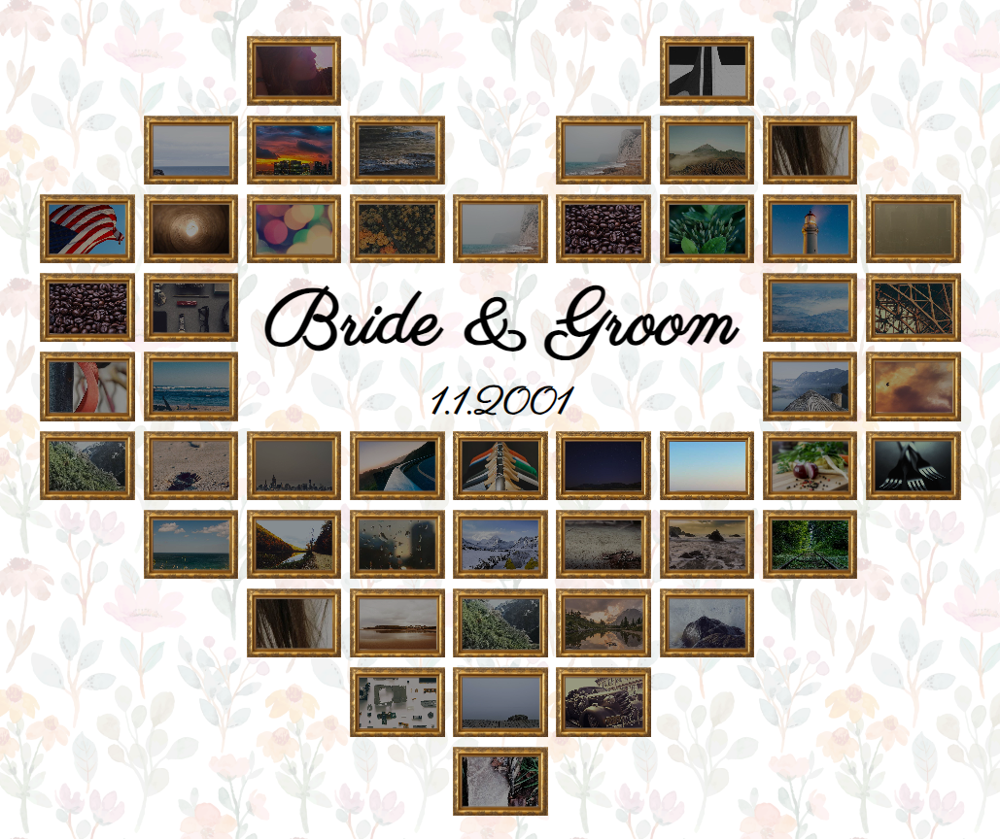

# Wedding gallery 
[link ⭧](https://zuzoup.github.io/_wedding-gallery/)

A little HTML+CSS+JS project that started as a simple visual layout of a photo wall for my mom's wedding. I wanted to see how many photos I need, how big they should be, how big the inner lettering should be etc. Creating a grid layout was quicker and easier than using Canva or Photoshop.

